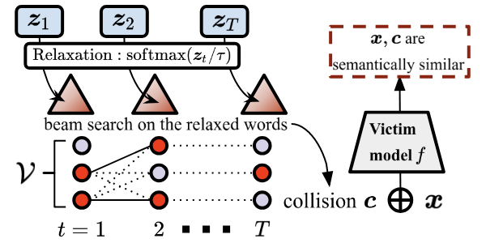

# Adversarial Semantic Collisions
This repo contains implementation for EMNLP 2020 paper: 
[Adversarial Semantic Collisions](https://arxiv.org/pdf/2011.04743.pdf).


## Dependencies
The code is tested on Python 3 with torch==1.4.0 and transformers==2.8.0. 
Other requirements can be found in `requirements.txt`.

## Datasets and Models
We considered four tasks in this paper. The data and models can be downloaded from [here](https://zenodo.org/record/4263446#.X6iYUnVKjCJ) (the decompressed file can take upto 18GB of disk space).
Please extract the data and models into `COLLISION_DIR` defined in `constant.py`.

### Target Models
* For paraphrase identification task, the models are trained with HuggingFace example [scripts](https://github.com/huggingface/transformers/blob/master/examples/text-classification/run_glue.py).
* For response suggestions task, the models are collected from [ParlAI](https://parl.ai/projects/polyencoder/).
* For document retrieval task, the models are collected from [Birch](https://github.com/castorini/birch).
* For extractive summarization task, the models are collected from [PreSumm](https://github.com/nlpyang/PreSumm).


### Language Models for Natural Collisions
For generating natural collisions (see Section 4.2.2 in our paper), we need to train language models (LMs) with the same
vocabulary as the target models we are attacking. 
We provide pre-trained LMs in the download link above and their training scripts in `scipts/` folder. 
LMs are fine-tuned from BERT or [Poly-encoder](https://arxiv.org/pdf/1905.01969.pdf) on [WikiText-103](https://www.salesforce.com/products/einstein/ai-research/the-wikitext-dependency-language-modeling-dataset/).


## Generating Semantic Collisions
Now we can run collision attacks on the test set for the four tasks.
We provide example scripts for as following, where (A), (R), (N) denotes aggressive, 
regularized and natural collisions respectively.
The provided attack arguments are the same for all test examples and 
a dedicated hyper-parameter search for each single example could yield better attack performance. 

Add `--verbose` flag if you want to check the intermediate procedure of generating collisions.
Remove `--fp16` flag if you did not install [apex](https://github.com/NVIDIA/apex) for mixed precision training.
Set `--gpu=i` to use the i'th GPU. 

### **Paraphrase Identification** 
```
(A) python3 collision_paraphrase.py --topk=30 --perturb_iter=30 --max_iter=10 --stemp=1.0 --lr=1e-3 --seq_len=20 --fp16

(R) python3 collision_paraphrase.py --topk=15 --perturb_iter=30 --max_iter=10 --stemp=1.0 --lr=1e-3 --seq_len=30 --regularize --beta=0.8 --fp16 

(N) python3 collision_paraphrase.py --topk=128 --perturb_iter=5 --stemp=0.1 --lr=1e-3 --seq_len=25 --nature --beta=0.05 --fp16
```

### **Response Suggestions**
```
(A) python3 collision_polyencoder.py --topk=30 --perturb_iter=30 --stemp=1.0 --lr=1e-3 --seq_len=20 --poly --num_filters=1000 --fp16

(R) python3 collision_polyencoder.py --topk=20 --perturb_iter=30 --stemp=1.0 --lr=1e-3 --seq_len=25 --regularize --beta=0.8 --poly --num_filters=1000 --fp16

(N) python3 collision_polyencoder.py --topk=128 --perturb_iter=5 --stemp=0.1 --lr=1e-3 --seq_len=20 --nature --beta=0.15 --poly --num_filters=1000 --fp16
```
Remove `--poly` flag if you want to attack the Bi-encoder model.

### **Document Retrieval** 
```
(A) python3 collision_retrieval.py --num_beams=5 --topk=50 --perturb_iter=30 --stemp=1.0 --lr=1e-3 --seq_len=30 --num_filters=1000 --fp16

(R) python3 collision_retrieval.py --num_beams=5 --topk=40 --perturb_iter=30 --stemp=1.0 --lr=1e-3 --seq_len=60 --num_filters=1000 --regularize --beta=0.85 --fp16

(N) python3 collision_retrieval.py --num_beams=10 --topk=150 --perturb_iter=5 --stemp=0.1 --lr=1e-3 --seq_len=35 --num_filters=1000 --nature --beta=0.02 --fp16
 
```
The default dataset is Core17, change `--data_name=core18` flag if you want to generate collisions for Core18.
Add `--verbose` flag to see how the document ranks change after inserting collisions.  

### **Extractive Summarization** 
```
(A) python3 collision_ext_sum.py --num_beams=5 --topk=10 --perturb_iter=30 --stemp=1.0 --lr=1e-3 --seq_len=15 --fp16

(R) python3 collision_ext_sum.py --num_beams=5 --topk=10 --perturb_iter=30 --stemp=1.0 --lr=1e-3 --seq_len=30 --beta=0.8 --regularize --fp16

(N) python3 collision_ext_sum.py --num_beams=5 --topk=64 --perturb_iter=5 --stemp=1.0 --lr=1e-3 --seq_len=20 --beta=0.02 --nature --fp16
```

### **Interactive Mode**

TODO

## Reference
```
@inproceedings{song2020adversarial,
  title={Adversarial Semantic Collisions},
  author={Song, Congzheng and Rush, Alexander M and Shmatikov, Vitaly},
  booktitle={Proceedings of the 2020 Conference on Empirical Methods in Natural Language Processing (EMNLP)},
  pages={4198--4210},
  year={2020}
}
```
